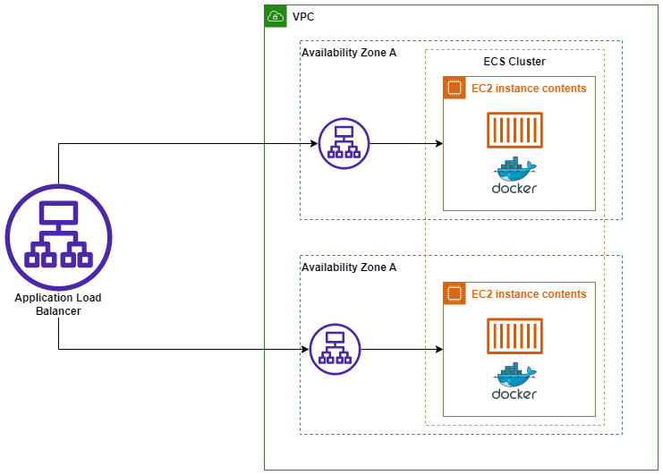
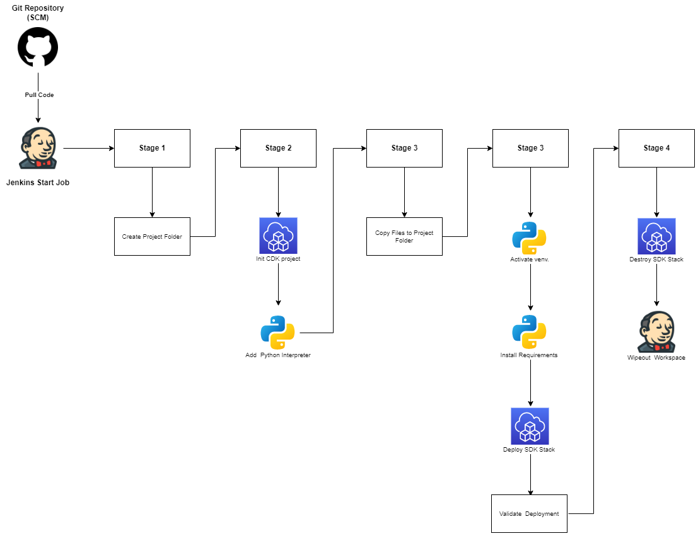

# AWS Hands-On implementar aplicación web con contenedores en Amazon ECS

## Descripción

Repositorio con el codigo y archivos necesarios para automatizar y orquestar un despliegue de aplicacion web con contenedores en Amazon ECS
utilizando el kit de desarrollo en la nube de AWS (CDK) con Python como lenguaje de programación y Jenkins.

## Diagrama

</img>

## Pipeline de despliegue

</img>

## <b>[Tutorial](https://www.linkedin.com/pulse/servidor-apache-con-aws-cdk-john-ramirez/)</b>
## <b>[< Home](https://github.com/datamadness81)</b>